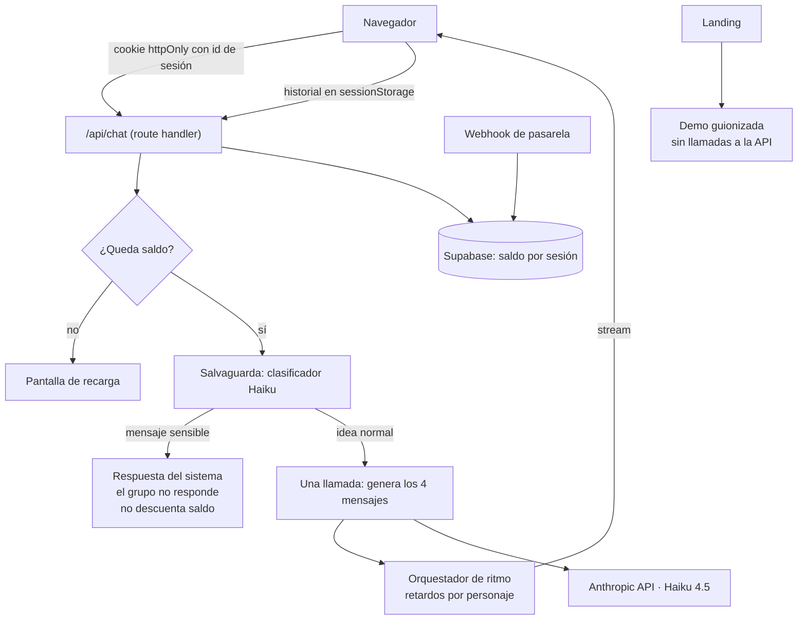

# Arquitectura técnica

Documento vivo. Actualizar cada vez que cambie el stack, la estructura de carpetas o cualquier
decisión técnica relevante. Los cambios deben registrarse también en `changelog/`.

---

## Stack seleccionado

| Capa | Tecnología | Justificación |
|------|-----------|---------------|
| Framework | **Next.js (App Router)** + TypeScript | Route handlers para la orquestación en servidor, streaming nativo, y es donde encaja AI Elements |
| Estilos | **Tailwind CSS + shadcn/ui + AI Elements** | AI Elements (Vercel) aporta hilo de mensajes, streaming y scroll anclado ya resueltos. Sobre shadcn/ui, así que el design system se aplica con tokens propios |
| Modelo | **Claude Haiku 4.5** (`claude-haiku-4-5`) vía SDK oficial | Rápido y barato. La calidad que pide el producto es tono y ritmo, no razonamiento profundo |
| Base de datos | **Supabase (Postgres)** | Una única tabla para el saldo. Elegido por familiaridad y porque el MCP permite operar el esquema desde el editor |
| Pagos | **Sin decidir** — tras un adaptador | El mecanismo es idéntico en Stripe / Lemon Squeezy / BMC; la decisión es fiscal, no técnica (ver `business.md`) |
| Email | **Resend** (SHOULD, no MVP) | Solo para el enlace de recuperación de saldo |
| Despliegue | **Vercel** | Zero-config para Next.js, previews por rama, dominio ya comprado |
| Gestor de paquetes | **pnpm v11** | Convención del proyecto. Nunca npm ni yarn |

---

## Diagrama de componentes



---

## Estructura de carpetas

```
src/
├── app/
│   ├── page.tsx              → Landing con la demo guionizada
│   ├── chat/                 → El chat de pago
│   └── api/
│       ├── chat/             → Orquestación de la tanda + salvaguarda
│       └── webhooks/pago/    → Acredita saldo tras el pago
├── components/
│   ├── ui/                   → shadcn/ui + AI Elements (generados)
│   └── chat/                 → MessageBubble, ChatHeader, CastCard, ScriptedDemo, DoodleBackground
├── lib/
│   ├── elenco/               → Prompts de los personajes y ritmo. El corazón del producto
│   ├── salvaguarda/          → Clasificador de mensajes sensibles
│   ├── saldo/                → Sesión anónima y descuento de mensajes
│   ├── pago/                 → Adaptador de pasarela (interfaz + implementación)
│   └── supabase/             → Cliente y helpers
└── types/
```

`lib/elenco/` es el directorio más importante del repositorio y el que la gente va a ir a leer
primero cuando lo clone. Se escribe pensando en que se lee.

---

## Estrategia de autenticación

**No hay autenticación.** No hay usuarios, contraseñas, sesiones de auth ni perfiles. Hay saldo
atado a un identificador anónimo:

1. Al pagar, el webhook genera un identificador aleatorio largo (`crypto.randomUUID()` o similar) y
   crea una fila: `id_sesion`, `saldo_micros`, `creado_en`.
2. Ese identificador viaja al navegador en una **cookie firmada, `httpOnly`, `Secure`,
   `SameSite=Lax`**. No es legible desde JavaScript.
3. Cada envío, el route handler lee la cookie, busca la fila, comprueba que hay saldo suficiente,
   llama al modelo y **descuenta el coste real de la respuesta**.

**El saldo se mide en coste de API, no en mensajes** — ver `docs/data-model.md` para el esquema y las
sentencias. Como el coste no se conoce hasta que el modelo responde, el orden es **comprobar contra un
umbral → llamar → descontar**, nunca descontar por adelantado. El usuario ve una estimación en
mensajes restantes, jamás una cifra en dólares.

**Por qué no se puede manipular:** el saldo no está en el cliente. El navegador solo tiene un
identificador opaco. Si el usuario lo altera, el servidor no encuentra esa fila y no hay saldo que
gastar. No hay nada que falsificar porque no hay ningún número en su máquina.

**El descuento es atómico y va después de la respuesta.** Si la llamada al modelo falla, no se
descuenta nada: no hay coste que cobrar porque no ha habido respuesta.

**Recuperación (SHOULD).** El único agujero real es perder la cookie: borrar cookies o cambiar de
dispositivo deja el saldo huérfano. Se resuelve con un enlace de recuperación enviado por email tras
el pago — el email lo captura la pasarela de todos modos. Es un recibo con enlace, no una cuenta.

**Límite de abuso.** Límite de peticiones por IP en el route handler, para que nadie pueda martillear
el endpoint aunque no tenga saldo.

---

## Privacidad y datos

**No se persiste ninguna conversación.** La conversación vive en `sessionStorage` del navegador y
viaja al servidor en cada petición para dar contexto al modelo. El servidor no la guarda en ningún
sitio: en la base de datos solo hay un identificador aleatorio y un número.

Esto simplifica enormemente las obligaciones de datos personales —no hay datos personales que
proteger— y encaja con un producto donde la gente escribe ideas que aún no ha contado a nadie.

Consecuencia asumida: un usuario podría manipular el historial que envía. No gana nada con ello
salvo gastar su propio saldo, así que no se protege.

---

## La salvaguarda: cuando el mensaje no es una idea

Este es el riesgo real del producto y estaba marcado como pendiente desde el PRD. Palmaditas está
diseñado para aplaudir cualquier cosa que se escriba. La mayoría de las veces eso es una idea de
negocio regular y la coña funciona. Pero alguien, en algún momento, va a escribir ahí algo que no es
una idea: que lo va a dejar todo, que está fatal, algo personal y serio. **Cuatro personajes
aplaudiendo con emojis en ese momento pasa de gracioso a desagradable en un segundo**, y es
exactamente la captura que no quieres que circule.

**Solución: un clasificador separado, antes de que el grupo responda.**

```
mensaje del usuario → clasificador (llamada corta a Haiku) → ¿sensible?
                                                              ├─ no → el grupo responde
                                                              └─ sí → respuesta del sistema
```

**Por qué un clasificador aparte y no una instrucción en el prompt del elenco.** No se le puede
pedir al mismo prompt que aplauda todo incondicionalmente y a la vez detecte cuándo no debe
aplaudir: son objetivos que se pelean, y el prompt está optimizado con fuerza hacia el primero.
Separar la responsabilidad es notablemente más fiable.

**Coste:** una llamada corta adicional por mensaje, del orden de 0,0005 $. Sube el coste por tanda
en torno a un 15 % y sigue siendo despreciable. **Latencia:** unos cientos de milisegundos, que se
absorben dentro del retardo que los personajes tienen antes de empezar a escribir. El usuario no
nota nada.

**El clasificador debe ser conservador.** Solo salta ante señales claras: autolesión, crisis
personal grave, duelo, violencia, enfermedad seria. **No** ante tristeza genérica, humor negro,
sarcasmo o una idea sobre un tema oscuro. Un falso positivo mata el producto —cuentas un chiste
negro y te sale una línea de ayuda— y es un fallo tan grave como un falso negativo. Se calibra con
una batería de casos límite antes de lanzar.

**Qué pasa cuando salta:**

- El grupo **no responde**. No se genera la tanda.
- Aparece un mensaje del sistema, visualmente distinto de las burbujas del elenco: sin color de
  personaje, sin avatar, sin efecto de escritura.
- Tono breve y sin dramatismo. Reconoce lo que ha escrito, dice con claridad que este no es el
  sitio para eso, y ofrece recursos de ayuda cuando corresponda.
- **No descuenta saldo.** Cobrar por eso sería indecente.
- El usuario puede seguir escribiendo con normalidad después.

Este comportamiento es **bloqueante para el lanzamiento**: la web de pago no sale sin él.

---

## Integraciones externas

- **Anthropic API** — generación de las tandas y clasificador de la salvaguarda. Se llama desde
  route handlers; la clave nunca llega al cliente.
- **Búsqueda web (herramienta de servidor de Anthropic)** — solo para Bego. Se declara como
  `web_search_20250305` en la misma llamada de la tanda, con un tope de 3 búsquedas. Tres
  consecuencias que hay que tener presentes: **añade latencia** (compite contra el techo de 10 s por
  tanda), **se factura aparte de los tokens**, y **puede pausar la llamada** (`stop_reason:
  "pause_turn"`), que se reintenta reenviando la conversación.
- **Supabase** — saldo por sesión. Una tabla.
- **Pasarela de pago** — sin decidir. Detrás de una interfaz `AdaptadorDePago` con dos operaciones:
  crear el cobro y procesar el webhook de confirmación. Cambiar de proveedor es escribir una
  implementación nueva, no tocar el producto.
- **Resend** (SHOULD) — enlace de recuperación de saldo.

---

## MCPs del proyecto

Pendiente de configurar. La propuesta se plantea al usuario según el "Protocolo de MCPs" de
`CLAUDE.md`, y se rellena esta tabla al hacerlo.

| Servidor | Alcance | Para qué se usa | Variables necesarias |
|----------|---------|-----------------|----------------------|
| <!-- --> | <!-- --> | <!-- --> | <!-- --> |

Las claves reales nunca van en `.mcp.json`: se referencian como `${VARIABLE}` y el valor vive en
`.env.local` o en el entorno del shell.

---

## Estrategia de despliegue

- **Ramas:** trabajo en ramas, PR contra `main`, `main` despliega a producción.
- **Previews:** Vercel genera una preview por rama. Útil sobre todo para el ritmo del chat, que hay
  que *ver* para juzgar.
- **Entornos:** local (`pnpm dev` con clave propia) → preview → producción.
- **Variables por entorno:** clave de Anthropic, credenciales de Supabase, secreto de firma de
  cookie y claves de la pasarela. Todas en `.env.example`, vacías.
- **Autohospedado:** el mismo código arranca sin variables de pasarela ni de Supabase. Si no hay
  configuración de pago, no hay saldo ni límite: se ejecuta contra la clave de API del usuario. Esa
  bifurcación se resuelve en el arranque, no con un build distinto.

---

## Decisiones técnicas relevantes

### 2026-08-12 — Una llamada por tanda, no una por personaje

**Contexto:** cuatro personajes deben responder a cada mensaje del usuario.
**Opciones:** (a) una llamada por personaje, con su propio prompt; (b) una única llamada que genera
los cuatro mensajes.
**Decisión:** (b).
**Consecuencias:** cuesta alrededor de un tercio, porque el historial se envía una vez en lugar de
cuatro. Y sale mejor: el modelo ve todo el intercambio a la vez, así que las referencias cruzadas
—Rosa contestándole a Iván— salen solas en vez de haber que fingirlas. A cambio, las cuatro voces
conviven en un prompt y hay que vigilar que no se contaminen entre sí.

### 2026-08-12 — Claude Haiku 4.5 sin caché de prompt

**Contexto:** elección de modelo y optimización de coste.
**Decisión:** Haiku 4.5, y **no contamos con la caché de prompt**.
**Consecuencias:** Haiku 4.5 exige un prefijo de al menos 4.096 tokens para cachear y nuestro prompt
no llega ni de lejos. Las estimaciones de `business.md` están hechas sin ese descuento, así que son
el suelo. Si el elenco crece y el prompt supera el umbral, mejoran solas.

### 2026-08-12 — Saldo en servidor, sin autenticación

**Contexto:** cobrar sin cuentas de usuario, sin que el saldo sea manipulable.
**Opciones:** (a) saldo firmado en el propio cliente; (b) saldo en servidor con identificador opaco
en cookie.
**Decisión:** (b).
**Consecuencias:** hace falta una base de datos, pero mínima. A cambio no hay nada que falsificar en
el cliente. El coste es perder el saldo al borrar cookies, mitigado con el enlace de recuperación.

### 2026-08-12 — Salvaguarda como clasificador separado

**Contexto:** el producto aplaude cualquier cosa, incluido lo que no debería.
**Opciones:** (a) instrucción dentro del prompt del elenco; (b) clasificador aparte previo.
**Decisión:** (b). Ver la sección "La salvaguarda" arriba.
**Consecuencias:** una llamada extra por mensaje (~15 % más de coste, despreciable) y una batería de
casos límite que mantener. **Bloqueante para el lanzamiento.**

### 2026-08-12 — Compactación del historial y degradación por saldo

**Contexto:** el historial entero viaja en cada llamada, así que el coste por tanda crece con la
conversación y el acumulado es cuadrático. Medido: una conversación de 20 mensajes cuesta ~0,10 $;
una de 100, **~1,50 $** — vez y media el saldo entero.

**Decisión, en tres piezas:**

1. **Compactación propia.** Cuando la entrada de una tanda supera **5.000 tokens** (sobre la tanda
   13-15), se resume todo menos las cuatro últimas tandas y el resumen sustituye a lo anterior. El
   coste por tanda deja de crecer y se estabiliza; esos 100 mensajes bajan de 1,50 $ a ~0,50 $. **La
   compactación del lado del servidor (`compact_20260112`) no está disponible en Haiku 4.5**, así que
   se hace con una llamada propia — que además permite decidir qué se conserva.
2. **Reserva del 5 %.** El saldo se considera agotado al llegar al 5 % del paquete, no a cero, para
   absorber una tanda más cara de lo previsto sin dejar el saldo en negativo.
3. **Degradación en lugar de corte.** Al entrar en esa reserva **se desactiva la búsqueda web pero se
   puede seguir conversando**, con un aviso que explica exactamente qué se ha desconectado y qué se
   recupera recargando. Cortar del todo es hostil; quitar solo lo caro es honesto y convierte el
   límite en un argumento para recargar.

**Qué conserva el resumen, sin excepción:** la idea original con sus detalles concretos, las
decisiones tomadas, las objeciones y **los datos verificados con su URL**. Los datos con fuente son
lo único comprobable del producto; perderlos en un resumen sería peor que no resumir.

**Consecuencias:** una llamada extra cada ~13 tandas (barata) y el riesgo de que un resumen pierda
algo que importaba. Por eso se conservan cuatro tandas íntegras: el hilo inmediato nunca pasa por el
resumen.

### 2026-08-12 — El saldo se mide en coste de API, no en mensajes

**Contexto:** el modelo de "100 mensajes por 5 €" se rompió en cuanto una función nueva —la búsqueda—
multiplicó por cinco el coste de una tanda. Contar mensajes obliga a poner el precio pensando en el
peor caso o a comerse la diferencia.
**Decisión:** el saldo es consumo real de API (`saldo_micros`, millonésimas de dólar). 5 € acreditan
1 $ de consumo, unos 250 mensajes normales. **Al usuario se le muestra una estimación en mensajes, no
el saldo en dinero.**
**Consecuencias:** el precio aguanta cualquier cambio de coste futuro sin rehacerlo, y quien usa
funciones caras las paga. A cambio, el descuento pasa a ser posterior a la llamada (con un umbral
previo para que un mensaje caro no deje el saldo en negativo relevante), y hay que mantener una
estimación de mensajes que es aproximada por definición — si se desvía mucho del consumo real, el
usuario notará que el contador baja a saltos.

### 2026-08-12 — La búsqueda solo se activa al etiquetar a alguien

**Contexto:** con la búsqueda web declarada en todas las tandas, la primera medición dio 12.971
tokens de entrada frente a los 1.881 de una tanda normal — los resultados de búsqueda entran en el
contexto. El coste por tanda se multiplicó por cinco (0,0033 $ → 0,0165 $), lo que situaba un paquete
de 100 mensajes en 2-3 $ sobre 5 € de ingreso.

Se detectó además un efecto secundario en el guion: Bego escribía "espera que lo miro" y la tanda
terminaba sin el dato, obligando al usuario a preguntar "¿qué miras?".

**Opciones consideradas:** (a) quitar la búsqueda; (b) dejarla siempre y subir el precio; (c)
activarla solo bajo demanda del usuario.
**Decisión:** (c), mediante **menciones con `@`** al estilo de las apps de mensajería. Si el usuario
escribe `@Bego …`, contesta solo ella y solo entonces tiene buscador. Sin mención no hay herramienta
declarada, y Bego da datos de memoria diciendo explícitamente que son a bote pronto.
**Consecuencias:** el coste medio vuelve a ~0,0046 $ por mensaje con un uso razonable de la mención.
Se gana una mecánica de producto que además da control al usuario, y desaparece el "espera que lo
miro" sin resultado. A cambio, hay dos modos de Bego que hay que mantener coherentes, y el usuario
tiene que descubrir que las menciones existen — la interfaz debe hacerlo evidente.

### 2026-08-12 — Bego busca de verdad, con fuente enlazada

**Contexto:** el diseño original le hacía inventarse estadísticas. En la primera prueba con una idea
real, sus cifras salieron plausibles en lugar de absurdas —dio precios de alquiler de una ciudad
concreta— y se usaron como información real.
**Opciones consideradas:** (a) forzar que las cifras fueran imposibles para que nadie se las creyera;
(b) mantener cifras plausibles inventadas y añadir un aviso; (c) darle búsqueda web real.
**Decisión:** (c). La (b) se descartó porque un aviso de "la IA puede cometer errores" describe mal
un sistema *instruido para inventar*, y compite en desventaja contra un dato con formato de informe.
La (a) era segura pero renunciaba a la utilidad que el producto había demostrado tener.
**Consecuencias:** el producto gana una parte fiable y verificable —lo que lleva enlace es real—
mientras el resto sigue siendo humor. A cambio: latencia, coste por búsqueda, manejo de `pause_turn`,
y Bego deja de ser la que se inventa las cosas para ser la que las mira.

### 2026-08-12 — Demo guionizada en lugar de prueba gratuita

**Contexto:** enseñar el producto sin regalar uso.
**Decisión:** la landing reproduce una conversación fija con el mismo motor de ritmo que el chat
real, sin tocar la API.
**Consecuencias:** coste cero por visita y control total sobre la primera impresión. Obliga a que la
demo comparta componentes con el chat real: si se ven distintos, la demo miente.
