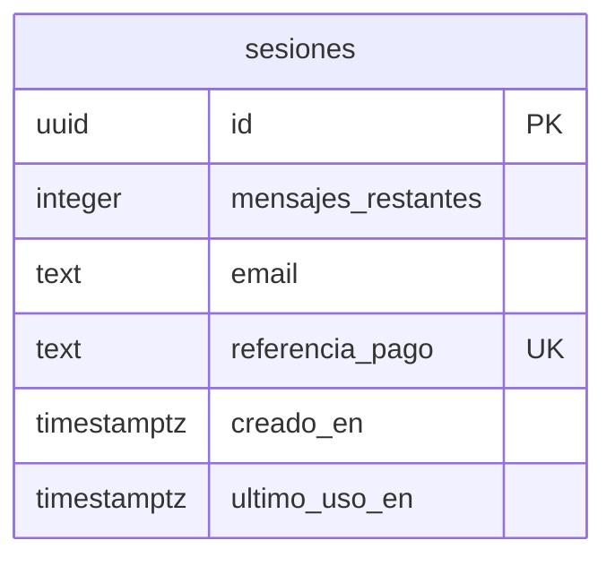

# Modelo de datos

Consultar antes de hacer cualquier migración. Actualizar en la misma sesión en que se cambie el
esquema.

---

## Principio: guardar lo mínimo

Palmaditas no guarda conversaciones. La conversación vive en `sessionStorage` del navegador y viaja
al servidor en cada petición solo para dar contexto al modelo. **En la base de datos hay un
identificador aleatorio y un número.** Nada más.

Eso no es minimalismo por gusto: la gente escribe aquí ideas que todavía no ha contado a nadie, y la
mejor forma de proteger eso es no tenerlo. Además reduce las obligaciones de datos personales casi a
cero.

---

## Entidades principales

### `sesiones`

Una fila por compra. Es la única tabla del proyecto.

| Campo | Tipo | Descripción |
|-------|------|-------------|
| `id` | `uuid` PK, default `gen_random_uuid()` | El identificador que viaja en la cookie firmada |
| `mensajes_restantes` | `integer` NOT NULL, `CHECK >= 0` | Saldo. La restricción impide que quede en negativo por una carrera |
| `email` | `text` NULL | Solo para el enlace de recuperación. Nulo si no se capturó |
| `referencia_pago` | `text` NOT NULL, **UNIQUE** | Id del cobro en la pasarela |
| `creado_en` | `timestamptz` NOT NULL, default `now()` | |
| `ultimo_uso_en` | `timestamptz` NULL | Se actualiza en cada mensaje. Solo para limpieza |

**`referencia_pago` es UNIQUE a propósito, y hace de mecanismo de idempotencia.** Las pasarelas
reintentan los webhooks: si el mismo cobro llega dos veces, el segundo `INSERT` falla contra el
índice único y no acreditamos saldo por duplicado. Es más fiable que llevar el control en el código.

**No hay tabla de mensajes, de conversaciones ni de usuarios.** Si alguna vez aparece una, conviene
releer este documento antes: probablemente signifique que se ha colado un requisito que
contradice la privacidad del producto.

---

## Relaciones entre entidades



Sin relaciones: una sola tabla, sin claves foráneas. Es deliberado y es la consecuencia directa de
no tener cuentas.

---

## Políticas de acceso (RLS)

### `sesiones`

- **RLS activado, y ninguna política creada.**
- Con RLS activo y sin políticas, la clave pública (`anon`) **no puede leer ni escribir nada**. Es
  exactamente lo que queremos.
- El acceso se hace únicamente desde route handlers del servidor con la clave de servicio, que
  salta RLS.

**La clave de servicio nunca puede llegar al cliente.** Vive en variables de entorno del servidor y
no se prefija con `NEXT_PUBLIC_`. Cualquier `import` de este módulo desde un componente de cliente
es un fallo de seguridad, no un detalle de estilo.

---

## Operaciones sobre el saldo

**Descuento atómico, en una sola sentencia.** Nunca leer el saldo, decidir en el código y luego
escribir: dos peticiones simultáneas gastarían el mismo mensaje dos veces.

```sql
UPDATE sesiones
   SET mensajes_restantes = mensajes_restantes - 1,
       ultimo_uso_en      = now()
 WHERE id = $1
   AND mensajes_restantes > 0
RETURNING mensajes_restantes;
```

Si no devuelve ninguna fila, no había saldo: se responde con la pantalla de recarga y **no se llama
al modelo**. Si la llamada al modelo falla después, se devuelve el mensaje al saldo con el `UPDATE`
inverso.

---

## Retención y limpieza

**Los mensajes comprados no caducan.** Se han pagado; expirarlos sería quedarse con dinero por algo
no entregado.

La limpieza se limita a las sesiones agotadas: se borran las filas con `mensajes_restantes = 0` y
`ultimo_uso_en` de hace más de 90 días. Tarea programada (`pg_cron`), sin operativa manual.

---

## Migraciones

| Fecha | Archivo | Descripción |
|-------|---------|-------------|
| _pendiente_ | `001_sesiones.sql` | Tabla `sesiones`, índice único en `referencia_pago`, RLS activado sin políticas |

---

## Datos seed

Ninguno. El proyecto arranca con la tabla vacía.

La versión autohospedada **no usa base de datos**: sin configuración de pasarela no hay saldo que
llevar, así que se ejecuta contra la clave de API del usuario sin límite ni persistencia.
