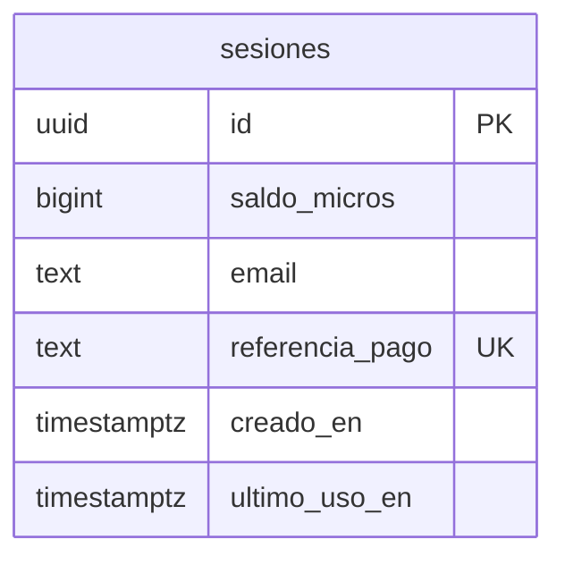

# Modelo de datos

Consultar antes de hacer cualquier migración. Actualizar en la misma sesión en que se cambie el
esquema.

---

## Principio: guardar lo mínimo

Palmaditas no guarda conversaciones. La conversación vive en `sessionStorage` del navegador y viaja
al servidor en cada petición solo para dar contexto al modelo. **En la base de datos hay un
identificador aleatorio y un número.** Nada más.

Eso no es minimalismo por gusto: la gente escribe aquí ideas que todavía no ha contado a nadie, y la
mejor forma de proteger eso es no tenerlo. Además reduce las obligaciones de datos personales casi a
cero.

---

## Entidades principales

### `sesiones`

Una fila por compra. Todavía no existe: entra con los pagos, en la Fase 2.

| Campo | Tipo | Descripción |
|-------|------|-------------|
| `id` | `uuid` PK, default `gen_random_uuid()` | El identificador que viaja en la cookie firmada |
| `saldo_micros` | `bigint` NOT NULL | **Saldo en millonésimas de dólar de coste de API.** 5 € de compra acreditan 1.000.000 (= 1 $) |
| `email` | `text` NULL | Solo para el enlace de recuperación. Nulo si no se capturó |
| `referencia_pago` | `text` NOT NULL, **UNIQUE** | Id del cobro en la pasarela |
| `creado_en` | `timestamptz` NOT NULL, default `now()` | |
| `ultimo_uso_en` | `timestamptz` NULL | Se actualiza en cada mensaje. Solo para limpieza |

**El saldo se mide en coste real, no en mensajes.** Un envío corto sin búsqueda gasta unos 3.300
micros; una tanda con búsqueda, unos 16.500. Así el modelo no se rompe cuando cambia el coste de una
función: simplemente el saldo baja más rápido.

**Enteros, no decimales.** Millonésimas de dólar en `bigint` en lugar de `numeric` o coma flotante:
los descuentos son sumas exactas y no hay redondeos que se acumulen a lo largo de una conversación.

> **Al usuario nunca se le muestra este número.** En pantalla se traduce a una estimación de
> mensajes restantes (`saldo_micros / coste_medio_por_mensaje`). "Te quedan 0,37 $" no significa nada
> para nadie, y le obliga a calcular si escribir de más le va a salir caro — justo lo que no
> queremos en un producto donde la gracia es soltar ideas sin pensar.

**`referencia_pago` es UNIQUE a propósito, y hace de mecanismo de idempotencia.** Las pasarelas
reintentan los webhooks: si el mismo cobro llega dos veces, el segundo `INSERT` falla contra el
índice único y no acreditamos saldo por duplicado. Es más fiable que llevar el control en el código.

**No hay tabla de mensajes, de conversaciones ni de usuarios.** Si alguna vez aparece una, conviene
releer este documento antes: probablemente signifique que se ha colado un requisito que
contradice la privacidad del producto.

---

### `eventos`

Una fila por mensaje del chat, más una por cada evento de la invitación al café. Es la tabla que
existe hoy, y **la única con datos en producción**.

**No guarda ningún contenido.** Ni el mensaje del usuario, ni los del grupo, ni el texto que hizo
saltar la salvaguarda. Solo números, y un hash con sal de la IP que no es reversible.

| Campo | Tipo | Descripción |
|-------|------|-------------|
| `id` | `bigserial` PK | |
| `tipo` | `text` NOT NULL, default `'mensaje'` | `mensaje`, `cafe_chat_visto`, `cafe_chat_pulsado`, `cafe_cupo_visto`, `cafe_cupo_pulsado` |
| `sesion` | `uuid` NOT NULL | Identificador aleatorio de conversación, generado en el navegador. No identifica a nadie |
| `indice` | `integer` NOT NULL | Posición del mensaje en la conversación. En los eventos de café, la tanda en la que se pidió |
| `con_mencion` | `boolean` NOT NULL | Si el usuario etiquetó a alguien con `@` |
| `salvaguarda` | `text` NULL | `comprobar`, `alto` o nulo. Nunca el texto que lo provocó |
| `tokens_entrada`, `tokens_salida`, `busquedas` | `integer` NOT NULL | Consumo de la tanda |
| `coste_micros` | `integer` NOT NULL | Coste en millonésimas de dólar: tanda + clasificador + búsquedas |
| `ip_hash` | `text` NULL | SHA-256 con sal de la IP. **Nunca la IP en claro** |
| `creado_en` | `timestamptz` NOT NULL | |

**`tipo` no es decorativo: el límite por IP cuenta filas de esta tabla filtrando por
`tipo = 'mensaje'`.** Si no filtrara, ver el botón del café gastaría cupo. Y por eso `/api/evento`
rechaza el tipo `mensaje` venga como venga: aceptarlo dejaría que cualquiera llenase el cupo de otra
persona sin gastar una llamada al modelo.

RLS activado y **sin políticas**: la clave pública no puede leer ni escribir nada. Solo el servidor,
con la service role.

---

## Relaciones entre entidades



Sin relaciones: una sola tabla, sin claves foráneas. Es deliberado y es la consecuencia directa de
no tener cuentas.

---

## Políticas de acceso (RLS)

### `sesiones`

- **RLS activado, y ninguna política creada.**
- Con RLS activo y sin políticas, la clave pública (`anon`) **no puede leer ni escribir nada**. Es
  exactamente lo que queremos.
- El acceso se hace únicamente desde route handlers del servidor con la clave de servicio, que
  salta RLS.

**La clave de servicio nunca puede llegar al cliente.** Vive en variables de entorno del servidor y
no se prefija con `NEXT_PUBLIC_`. Cualquier `import` de este módulo desde un componente de cliente
es un fallo de seguridad, no un detalle de estilo.

---

## Operaciones sobre el saldo

Como el coste no se conoce hasta que el modelo responde, el orden es **comprobar → llamar →
descontar**, no descontar por adelantado.

**1. Comprobar antes de llamar.** Con un umbral por delante, no con `> 0`: hay que asegurarse de que
queda para pagar la tanda más cara que esa petición pueda generar.

```sql
SELECT saldo_micros FROM sesiones WHERE id = $1;
-- Sin mención: exigir saldo_micros >= COSTE_MAX_TANDA_NORMAL
-- Con mención (puede buscar): exigir saldo_micros >= COSTE_MAX_TANDA_CON_BUSQUEDA
```

Si no llega, se responde con la pantalla de recarga y **no se llama al modelo**. Cuando el saldo da
para conversar pero no para buscar, se avisa en lugar de fallar: *"te queda poco, las búsquedas
gastan más"*.

**2. Descontar después, en una sola sentencia atómica** con el coste real de la respuesta:

```sql
UPDATE sesiones
   SET saldo_micros  = saldo_micros - $2,
       ultimo_uso_en = now()
 WHERE id = $1
RETURNING saldo_micros;
```

**Sin `CHECK >= 0` y sin condición en el `WHERE`:** el descuento tiene que aplicarse siempre, incluso
si deja el saldo ligeramente en negativo. Una respuesta ya entregada se cobra; lo que impide que eso
ocurra de forma relevante es el umbral del paso 1, no una restricción de la tabla. Un saldo negativo
simplemente significa que el usuario no puede enviar más hasta recargar.

**Si la llamada al modelo falla, no se descuenta nada** — no hay coste que cobrar porque no ha habido
respuesta.

---

## Retención y limpieza

**Los mensajes comprados no caducan.** Se han pagado; expirarlos sería quedarse con dinero por algo
no entregado.

La limpieza se limita a las sesiones agotadas: se borran las filas con `saldo_micros <= 0` y
`ultimo_uso_en` de hace más de 90 días. Tarea programada (`pg_cron`), sin operativa manual.

---

## Migraciones

| Fecha | Archivo | Descripción |
|-------|---------|-------------|
| 2026-08-19 | `001_eventos.sql` | Tabla `eventos`, índices por sesión, fecha e IP, RLS activado sin políticas |
| 2026-08-20 | `002_tipo_evento.sql` | Columna `tipo` e índice `(tipo, ip_hash, creado_en)` |
| _pendiente_ | `003_sesiones.sql` | Tabla `sesiones`, índice único en `referencia_pago`, RLS activado sin políticas |

---

## Datos seed

Ninguno. El proyecto arranca con la tabla vacía.

La versión autohospedada **no usa base de datos**: sin configuración de pasarela no hay saldo que
llevar, así que se ejecuta contra la clave de API del usuario sin límite ni persistencia.
