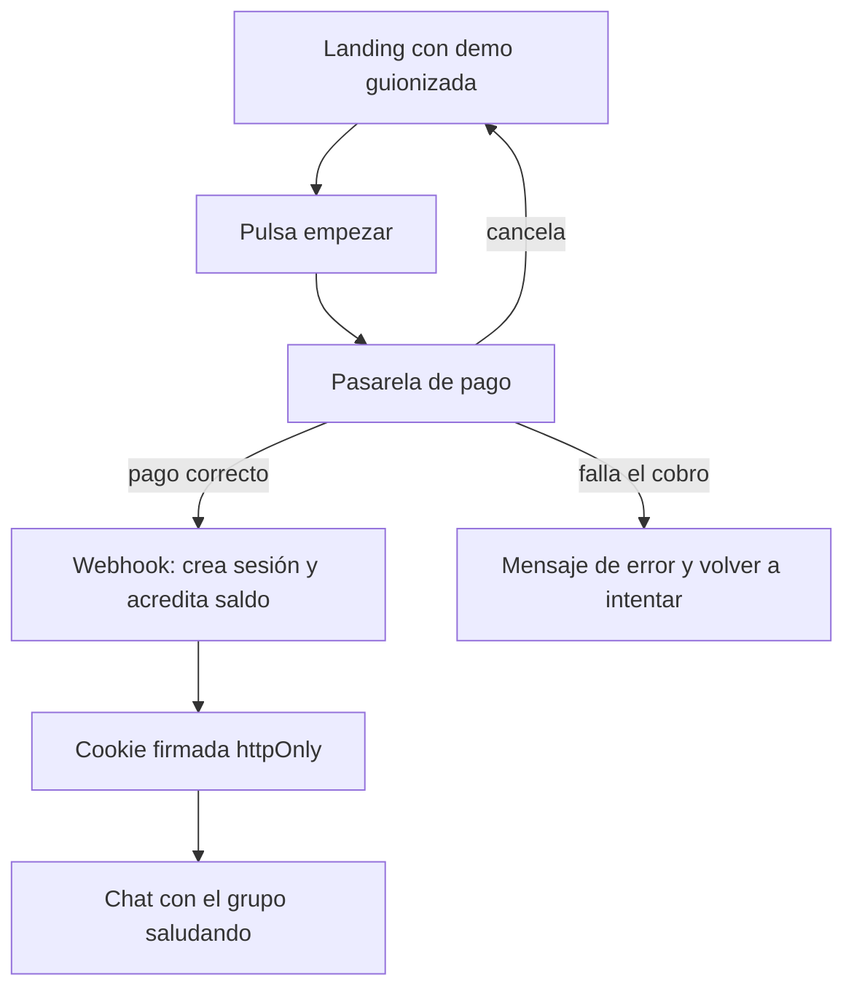
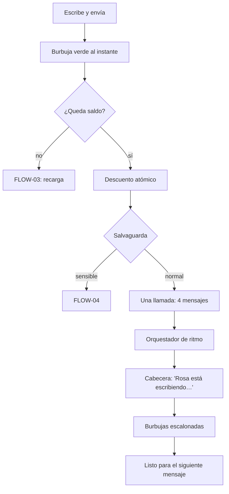
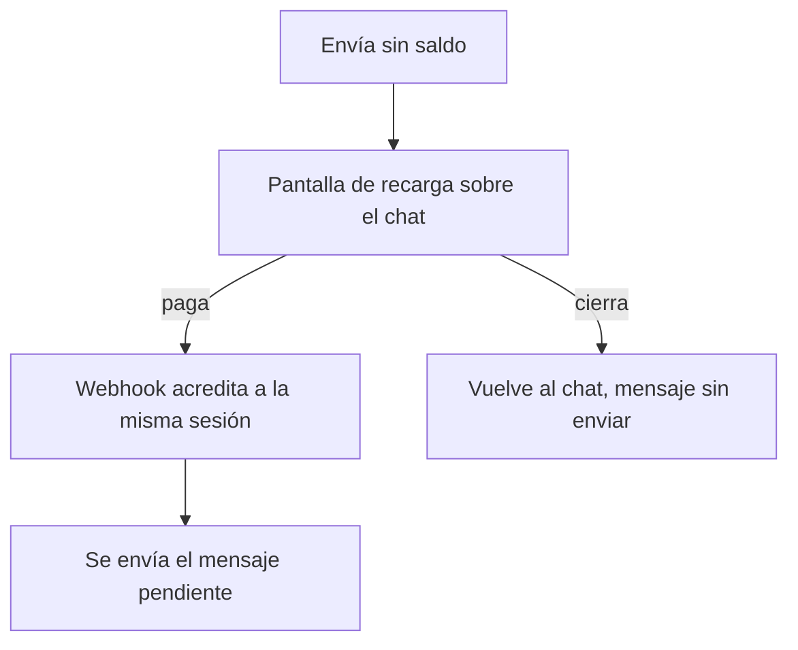
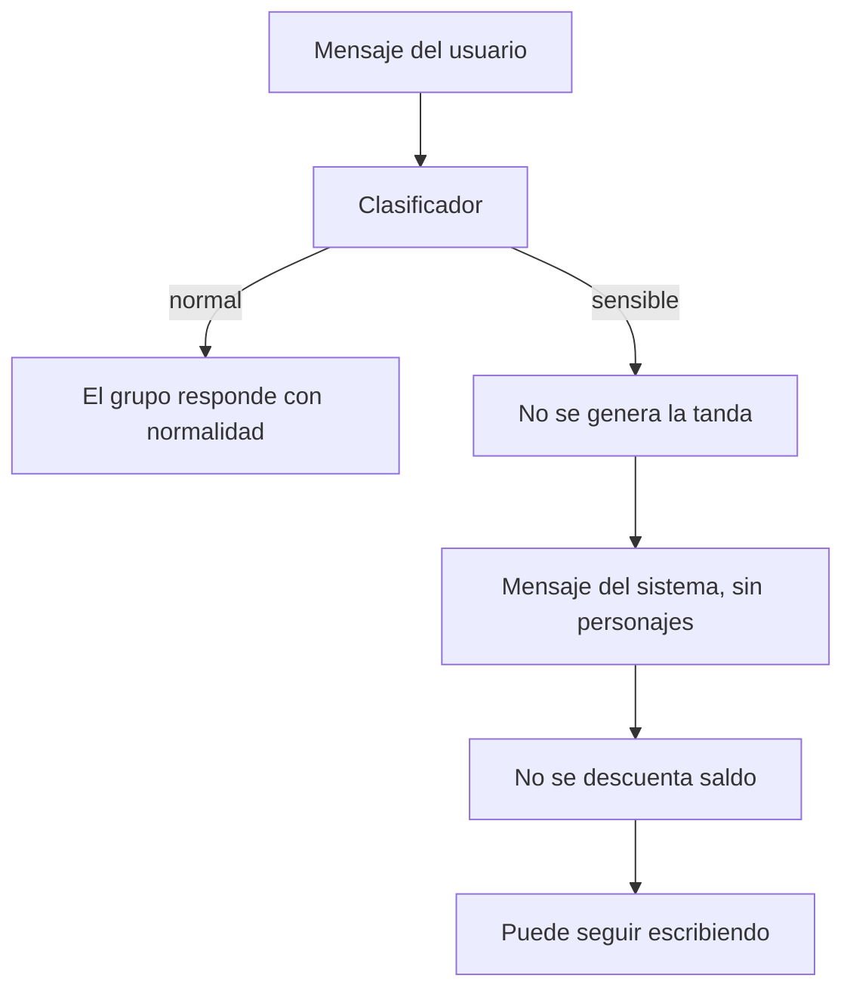
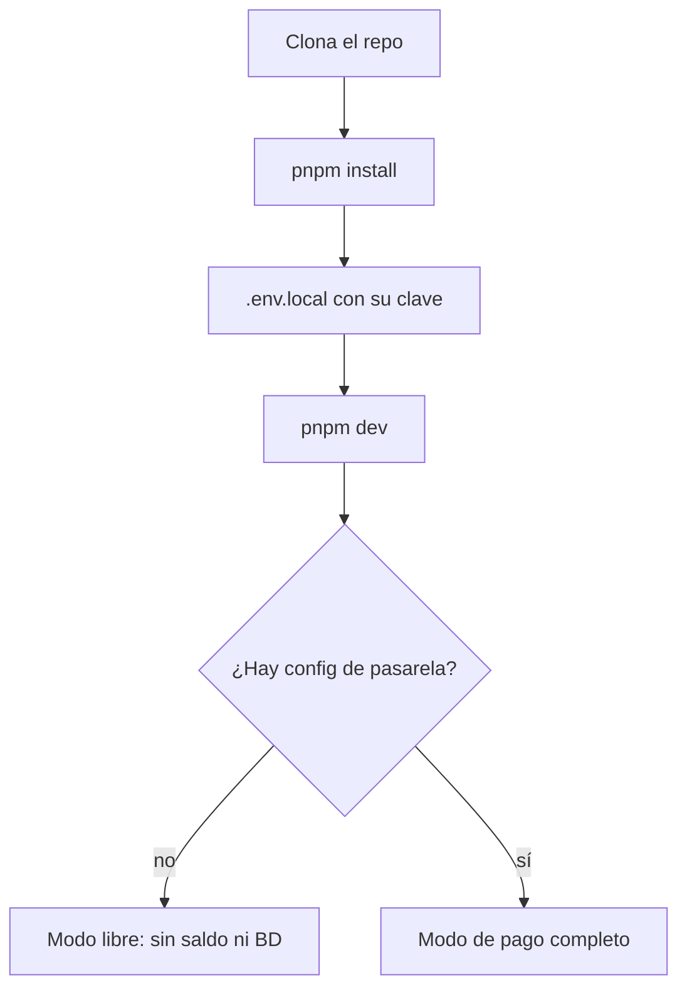

# Flujos de usuario

El PRD los describe narrativamente; aquí entran en detalle con diagramas, estados y casos de error.

---

## [FLOW-01] — Primera visita y compra

**Actor:** visitante que llega a palmaditas.com
**Trigger:** abre la web, normalmente desde una captura compartida
**Resultado esperado:** ha entendido el producto y está escribiendo en el chat

### Pasos

1. Llega a la landing. Ve el elenco presentado y, debajo, la **demo guionizada** reproduciéndose
   sola: una conversación de ejemplo con el ritmo real, incluida una pega de Iván y los otros tres
   echándosele encima.
2. Entiende el producto en unos quince segundos, sin coste para nosotros.
3. Pulsa el botón de empezar. Va a la pasarela de pago.
4. Paga. La pasarela redirige de vuelta.
5. El webhook crea la sesión y acredita el saldo; se le entrega la cookie firmada.
6. Aterriza en el chat, con el grupo ya saludando.

### Diagrama

### Casos de error

| Situación | Comportamiento |
|-----------|----------------|
| El usuario cancela en la pasarela | Vuelve a la landing sin ruido. No se ha cobrado nada |
| El cobro falla | Mensaje claro con opción de reintentar |
| **El webhook tarda más que la redirección** | Caso real y frecuente. El chat espera con un estado de "confirmando el pago…" y consulta hasta que la sesión existe. **Nunca decirle que no ha pagado** — ha pagado |
| El webhook llega dos veces | El índice único en `referencia_pago` lo absorbe. No se duplica saldo |

---

## [FLOW-02] — Conversación con el grupo

**Actor:** usuario con saldo
**Trigger:** escribe un mensaje y lo envía
**Resultado esperado:** el grupo le responde de forma escalonada y creíble

### Pasos

1. Escribe su idea y envía. Su mensaje aparece al instante en verde, con doble check.
2. Se descuenta un mensaje del saldo, en el servidor, antes de llamar al modelo.
3. Pasa la salvaguarda (ver FLOW-04).
4. Se genera la tanda: los cuatro mensajes en una sola llamada.
5. El orquestador los suelta escalonados. La cabecera va mostrando quién escribe.
6. El usuario puede seguir escribiendo mientras el grupo responde.

### Diagrama

### Casos de error

| Situación | Comportamiento |
|-----------|----------------|
| **Falla la llamada al modelo** | **Se devuelve el mensaje al saldo.** Aviso discreto y opción de reintentar. Cobrar por una respuesta que no llegó es inaceptable |
| Se corta la conexión a media tanda | Los mensajes ya mostrados se quedan. Al recuperar, no se reintenta solo: el usuario decide |
| El usuario envía varios seguidos muy rápido | Se encolan y se responden en orden. Cada uno descuenta su mensaje |
| Respuesta malformada del modelo | Se reintenta una vez en silencio. Si vuelve a fallar, se trata como fallo y se devuelve el saldo |

---

## [FLOW-03] — Saldo agotado y recarga

**Actor:** usuario que ha gastado sus mensajes
**Trigger:** intenta enviar sin saldo
**Resultado esperado:** recarga y sigue **sin perder la conversación**

### Pasos

1. Escribe y envía. No hay saldo.
2. Aparece la pantalla de recarga, sobre el chat, sin borrarlo.
3. Paga. El webhook acredita el saldo a **la misma sesión**.
4. Vuelve al chat exactamente donde estaba y su mensaje pendiente se envía.

### Diagrama

### Casos de error

| Situación | Comportamiento |
|-----------|----------------|
| Cierra la pantalla sin pagar | Vuelve al chat. Su texto sigue escrito en el campo de entrada, sin enviar |
| **La conversación se pierde al ir a pagar** | No debe ocurrir: la conversación vive en `sessionStorage` y la pasarela se abre sin descartar la pestaña. **Es el fallo más caro de este flujo** y hay que probarlo explícitamente |

---

## [FLOW-04] — Salvaguarda: el mensaje no es una idea

**Actor:** usuario que escribe algo personal y serio
**Trigger:** el clasificador marca el mensaje como sensible
**Resultado esperado:** el grupo no responde, y la respuesta no hace daño

Este es el flujo más importante del producto pese a ser el menos frecuente. Ver `architecture.md`
para la implementación.

### Pasos

1. El usuario escribe algo que no es una idea: que está fatal, una crisis personal, un duelo.
2. El clasificador lo marca antes de generar nada.
3. **El grupo no responde.** No hay tanda, no hay "escribiendo…", no hay burbujas de personajes.
4. Aparece un mensaje del sistema, visualmente distinto: sin color de personaje, sin avatar, sin
   efecto de escritura.
5. Tono breve y sin dramatismo: reconoce lo escrito, deja claro que este no es el sitio para eso, y
   ofrece recursos de ayuda cuando corresponda.
6. **No se descuenta saldo.**
7. Puede seguir escribiendo con normalidad después. No se le expulsa ni se le bloquea.

### Diagrama

### Casos de error

| Situación | Comportamiento |
|-----------|----------------|
| **Falso positivo** (chiste negro, sarcasmo, idea sobre un tema oscuro) | El daño real de este flujo. Rompe la experiencia y hace quedar mal al producto. El clasificador se calibra conservador y se prueba con una batería de casos límite |
| Falso negativo | El grupo aplaude algo que no debía. Menos frecuente pero más grave por captura. Se revisa la calibración con cada caso detectado |
| Falla el clasificador (error de API) | **Se falla hacia el lado seguro**: no se genera la tanda, se muestra un error genérico y no se descuenta saldo |

---

## [FLOW-05] — Uso autohospedado

**Actor:** alguien que prefiere no pagar, normalmente con perfil técnico
**Trigger:** llega al repositorio público
**Resultado esperado:** tiene Palmaditas funcionando en local con su clave

### Pasos

1. Clona el repositorio.
2. `pnpm install`.
3. Copia `.env.example` a `.env.local` y pone su `ANTHROPIC_API_KEY`.
4. `pnpm dev`, abre `localhost`.
5. Misma experiencia: sin pasarela, sin saldo, sin base de datos.

### Diagrama

### Casos de error

| Situación | Comportamiento |
|-----------|----------------|
| Arranca sin `ANTHROPIC_API_KEY` | Error claro en el arranque diciendo exactamente qué falta y dónde ponerlo. **No un fallo silencioso al enviar el primer mensaje** |
| Usa npm o yarn | El README deja claro que es pnpm v11 |
| Su clave no tiene saldo en Anthropic | El error de la API se muestra tal cual, sin envolverlo: es su cuenta y necesita el mensaje real |

---

## [FLOW-06] — Recuperar el saldo (SHOULD, no MVP)

**Actor:** usuario que borró cookies o cambió de dispositivo
**Trigger:** abre el enlace del email que recibió al pagar
**Resultado esperado:** recupera su saldo en el dispositivo actual

### Pasos

1. Al pagar recibió un email con un enlace que contiene su identificador de sesión.
2. Abre el enlace desde el dispositivo donde quiere seguir.
3. El servidor comprueba que la sesión existe y le entrega la cookie firmada.
4. Entra al chat con su saldo intacto, pero **sin la conversación anterior** — vivía en el navegador
   antiguo. Conviene decírselo, no dejar que lo descubra.

### Casos de error

| Situación | Comportamiento |
|-----------|----------------|
| Enlace de una sesión ya borrada | Mensaje claro: esa sesión ya no existe |
| El enlace circula o se filtra | Quien lo tenga puede gastar ese saldo. Asumido: el valor en juego son unos euros y la alternativa es montar cuentas. Se dice en el propio email |
